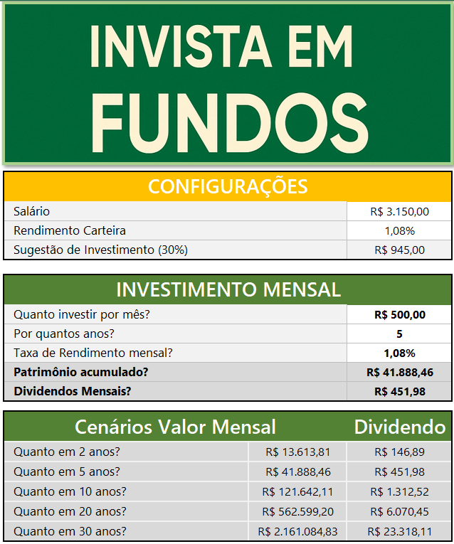
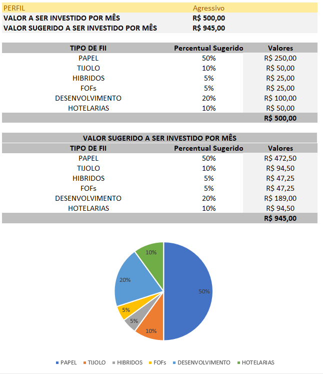

Simulador_Investimentos_Fundos_Imobiliarios

Simulador_Investimentos_Fundos_Imobiliarios - Santander - Excel com Inteligência Artificial

No desafio foi projetado uma ferramenta de simulação de investimentos em Excel, com o objetivo de aplicar os conceitos de Excel que ajude os usuários a realizarem simulações necessárias.

Foi feita as configurações de salário, porcentagem em carteira e sugestão de investimento (30%), no investimento mensal poderá informar o quanto investir, o tempo e a taxa de rendimento que já calcula o patrimônio acumulado e dividendos mensais;

Mostrando também os cenários Valor mensal e podendo mostrar a sugestão de investimento dependendo do perfil da pessoa;

Foi incrementado também com o valor conforme sugerido no inicio do projeto;

